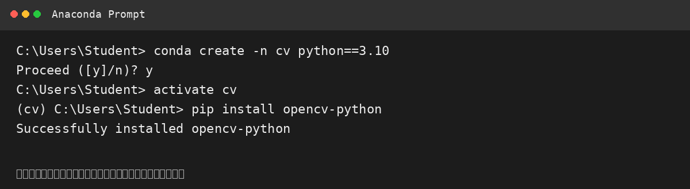
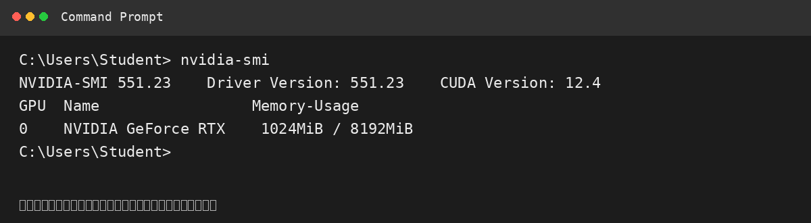
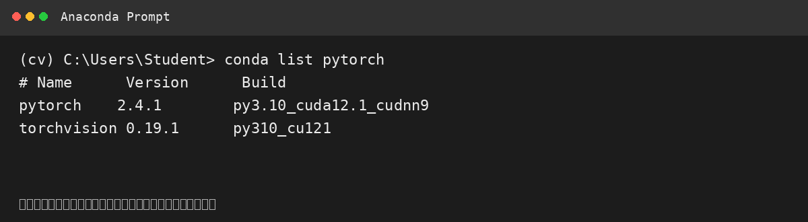
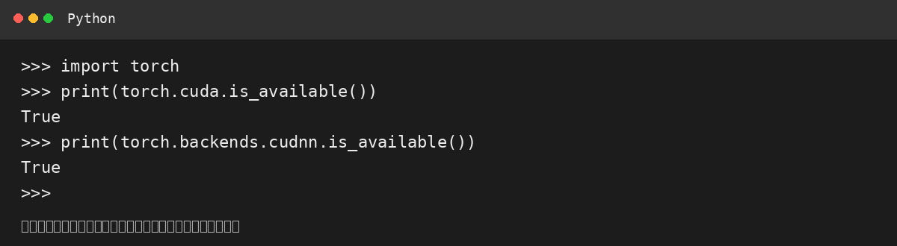

# 实验一：计算机视觉库的安装

> **说明：** 本报告根据课程提供的《实验一：计算机视觉库的安装》参考文档整理。
> 下方图片为**示例排版截图**，用于展示报告结构，不能作为本人实际运行记录使用；如课程要求实验真实性，应替换为实际运行截图。

## 一、实验目的

1. 掌握 Anaconda 的安装与基本操作。
2. 熟悉 GPU 使用环境的配置及对应版本 PyTorch 的安装。
3. 完成 OpenCV 的安装与配置。
4. 为后续计算机视觉实验搭建基本实验环境。

## 二、实验内容

### 1. Anaconda 的安装及配置

安装 Anaconda，并完成基本环境配置。

### 2. conda 的基本操作与 OpenCV 的安装

使用 conda 创建虚拟环境：

```bash
conda create -n cv python==3.10
```

进入虚拟环境：

```bash
activate cv
```

安装 OpenCV：

```bash
pip install opencv-python
```



### 3. GPU 加速环境配置

使用 `nvidia-smi` 查看显卡状态：

```bash
nvidia-smi
```

根据 GPU 环境安装对应版本的 CUDA Toolkit 和 cuDNN。



### 4. PyTorch 安装

结合 CUDA 版本，在 PyTorch 官网选择对应版本进行安装。

安装完成后使用：

```bash
conda list pytorch
```

查看 PyTorch 是否安装成功。



### 5. PyTorch GPU 加速环境验证

使用以下代码进行验证：

```python
import torch

print(torch.cuda.is_available())
print(torch.backends.cudnn.is_available())
```

示例验证结果：

```text
True
True
```



## 三、实验结果

本实验完成了计算机视觉实验环境搭建的主要步骤，包括 Anaconda、conda 虚拟环境、OpenCV、CUDA、cuDNN 和 PyTorch 的配置。

通过 `nvidia-smi` 可以查看 GPU 状态，通过 `conda list pytorch` 可以查看 PyTorch 安装情况，并通过 `torch.cuda.is_available()` 和 `torch.backends.cudnn.is_available()` 对 PyTorch 的 GPU 加速环境进行验证。

## 四、实验总结

通过本次实验，熟悉了 Anaconda 和 conda 虚拟环境的基本操作，掌握了 OpenCV 的安装方法，并了解了 CUDA、cuDNN 与 PyTorch GPU 加速环境之间的关系。

本实验为后续计算机视觉和深度学习相关实验提供了基本的软件环境。
